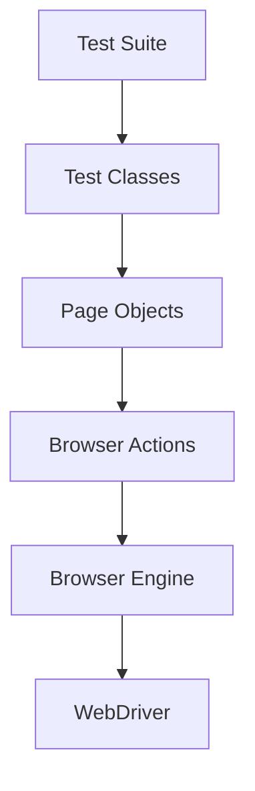

# System Patterns - DJI Bangalore UI Automation

## Architecture Overview

## Design Patterns

### 1. Page Object Model (POM)
- **Implementation**
  - Each web page has a corresponding Page class
  - Page classes contain page elements and actions
  - Tests interact with pages through their public methods
- **Benefits**
  - Improved maintainability
  - Reduced code duplication
  - Better test readability
  - Easier updates when UI changes

### 2. Factory Pattern
- **Implementation**
  - BrowserEngine class creates WebDriver instances
  - Supports multiple browser types (Chrome, Firefox)
  - Centralizes driver configuration
- **Benefits**
  - Encapsulated browser initialization
  - Easy addition of new browser types
  - Consistent driver configuration

### 3. Singleton Pattern
- **Implementation**
  - Single WebDriver instance per test
  - Static driver management in BrowserEngine
- **Benefits**
  - Resource efficiency
  - Consistent browser state
  - Simplified driver management

## Component Relationships

### 1. Test Layer
- **TestNG Test Classes**
  - Contains test methods
  - Uses page objects
  - Handles test flow and assertions
  - Manages test data

### 2. Page Layer
- **Page Objects**
  - Encapsulates page elements
  - Provides page-specific methods
  - Uses BrowserActions for interactions
  - Maintains element locators

### 3. Core Layer
- **BrowserActions**
  - Common browser operations
  - Screenshot capture
  - Element interaction methods
  - Logging and utilities

- **BrowserEngine**
  - Driver initialization
  - Browser configuration
  - Session management

## Key Technical Decisions

### 1. Browser Automation
- **Choice**: Selenium WebDriver
- **Rationale**
  - Industry standard
  - Broad browser support
  - Active community
  - Rich feature set

### 2. Test Framework
- **Choice**: TestNG
- **Rationale**
  - Flexible test configuration
  - Parallel execution support
  - Built-in assertions
  - Test grouping and prioritization

### 3. Build Tool
- **Choice**: Maven
- **Rationale**
  - Dependency management
  - Build lifecycle management
  - Plugin ecosystem
  - CI/CD integration

### 4. Additional Tools
- **WebDriverManager**
  - Automatic driver management
  - Cross-platform support
- **Lombok**
  - Reduced boilerplate code
  - Improved code readability

## Best Practices

### 1. Code Organization
- Logical package structure
- Clear naming conventions
- Separation of concerns
- Modular design

### 2. Test Design
- Independent tests
- Clear test purposes
- Reliable assertions
- Meaningful test names

### 3. Error Handling
- Screenshot capture on failure
- Detailed logging
- Proper exception handling
- Clear error messages

### 4. Maintenance
- Regular dependency updates
- Code review process
- Documentation updates
- Test stability monitoring
